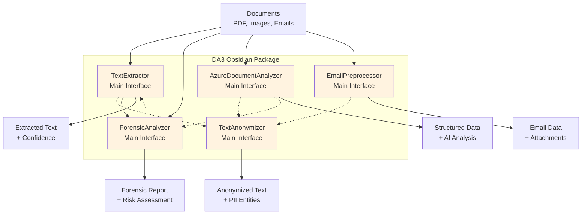

<p align="center">
	
</p>
<h1 align="center">
  DA3 Obsidian
</h1>
<p align="center">
  <strong>
    <a href="https://da3-atlas.azp-cto-alpr-aks-cluster.azp-cto-analytics-p.we1.azure.aztec.cloud.allianz/">DA3 Documentation</a>
    &nbsp;&nbsp;&bull;&nbsp;&nbsp;
    <a href="https://da3-atlas.azp-cto-alpr-aks-cluster.azp-cto-analytics-p.we1.azure.aztec.cloud.allianz/adapt_internal/githubflow/">CI/CD Setup</a>
    &nbsp;&nbsp;&bull;&nbsp;&nbsp;
    <a href="https://da3-atlas.azp-cto-alpr-aks-cluster.azp-cto-analytics-p.we1.azure.aztec.cloud.allianz/">Obsidian Documentation</a>
  </strong>
</p>


A comprehensive Python package for text extraction and anonymization, designed for document processing workflows.

## Overview

DA3 Obsidian provides five main capabilities:
- **Text Extraction**: Extract text from PDFs and images using OCR with quality validation
- **Text Anonymization**: Detect and anonymize personally identifiable information (PII) in text
- **Email Preprocessing**: Extract and process email data from .msg files with attachment handling
- **Forensic Analysis**: Detect document manipulation and fraud indicators
- **Azure Document Intelligence**: Intelligent document processing using Azure's AI services

## Architecture



## Installation

### Using uv (recommended)

```bash
uv add da3-obsidian
```

### Using pip

```bash
pip install da3-obsidian
```

### Installing spaCy models

For text anonymization to work properly, you need to install spaCy language models:

```bash
# Install models for supported languages
python -m spacy download en_core_web_lg
python -m spacy download es_core_news_lg
python -m spacy download fr_core_news_lg
python -m spacy download it_core_news_lg
```

Or use the optional dependency:

```bash
uv add "da3-obsidian[spacy-models]"
```

### Installing extract-msg for Email Processing

For email preprocessing to work properly, you need to install the extract-msg library:

```bash
# Install extract-msg
pip install extract-msg
```

Or use the optional dependency:

```bash
uv add "da3-obsidian[email-processing]"
```

## Quick Start

### Text Extraction

```python
from da3_obsidian.text_extraction import TextExtractor

# Initialize extractor
extractor = TextExtractor(language='en')

# Extract from PDF
text, confidence = extractor.extract_from_pdf('document.pdf')
print(f"Extracted text with {confidence} confidence: {text}")

# Extract from image
text = extractor.extract_from_image('image.png')
print(f"OCR result: {text}")
```

### Text Anonymization

```python
from da3_obsidian.text_anonymization import TextAnonymizer

# Initialize anonymizer
anonymizer = TextAnonymizer(language='en')

# Anonymize text
text = "My name is John Doe and my email is john.doe@example.com"
anonymized = anonymizer.anonymize(text)
print(f"Anonymized: {anonymized}")

# Analyze PII entities
entities = anonymizer.analyze(text)
for entity in entities:
    print(f"Found {entity.entity_type}: {entity.text}")
```

### Email Preprocessing

```python
from da3_obsidian.email_preprocessing import EmailPreprocessor

# Initialize email preprocessor
preprocessor = EmailPreprocessor(preserve_temp_files=False)

# Process an .msg file
email_data = preprocessor.process_msg_file('email.msg')

# Access email content
print(f"Subject: {email_data.subject}")
print(f"From: {email_data.sender}")
print(f"To: {email_data.to}")
print(f"Body: {email_data.body[:100]}...")

# Handle attachments
print(f"Attachments: {preprocessor.get_attachment_count(email_data)}")
for attachment in email_data.attachments:
    print(f"- {attachment.filename} ({attachment.size} bytes)")
    
# Clean up temporary files when done
preprocessor.cleanup_email_data(email_data)
```

### Forensic Analysis

```python
from da3_obsidian.forensic_analysis import ForensicAnalyzer

# Initialize analyzer
analyzer = ForensicAnalyzer()

# Analyze document for fraud indicators
result = analyzer.analyze_document('suspicious_document.pdf')
print(f"Risk Score: {result.risk_score}/100 ({result.risk_level})")
print(f"Fraud Indicators: {len(result.fraud_indicators)}")

# Check specific aspects
if result.has_metadata_issues:
    print("Metadata inconsistencies detected")
if result.has_image_manipulation:
    print("Potential image manipulation found")
```

### Complete Workflow Example

```python
from da3_obsidian import TextExtractor, TextAnonymizer, EmailPreprocessor, ForensicAnalyzer, AzureDocumentAnalyzer

# Initialize all components
extractor = TextExtractor(language='en')
anonymizer = TextAnonymizer(language='en')
email_processor = EmailPreprocessor()
forensic_analyzer = ForensicAnalyzer()
azure_analyzer = AzureDocumentAnalyzer()

# Process documents based on type
document_path = 'document.pdf'
if document_path.endswith('.msg'):
    # Process email
    email_data = email_processor.process_msg_file(document_path)
    
    # Anonymize email content
    anonymized_subject = anonymizer.anonymize(email_data.subject).anonymized_text
    anonymized_body = anonymizer.anonymize(email_data.body).anonymized_text
    
    print(f"Processed email: {anonymized_subject}")
    
    # Clean up when done
    email_processor.cleanup_email_data(email_data)
else:
    # Process regular document
    # 1. Verify document authenticity
    forensic_result = forensic_analyzer.analyze_document(document_path)
    print(f"Risk: {forensic_result.risk_level} ({forensic_result.risk_score}/100)")
    
    if not forensic_result.is_high_risk:
        # 2. Intelligent document analysis with Azure AI
        azure_result = azure_analyzer.analyze_document(document_path)
        print(f"Document Type: {azure_result.model_type}")
        
        # 3. Extract text content
        text, confidence = extractor.extract_from_pdf(document_path)
        
        # 4. Anonymize PII in extracted text
        anonymized_result = anonymizer.anonymize(text)
        print(f"Anonymized {len(anonymized_result.entities_found)} PII entities")
```

## Development

### Setup Development Environment

```bash
# Clone repository
git clone https://github.com/da3-team/da3-obsidian.git
cd da3-obsidian

# Install with development dependencies
uv sync --extra dev

# Install spaCy models
python -m spacy download en_core_web_lg
```

### Project Structure

```
da3_obsidian/
├── src/da3_obsidian/
│   ├── text_extraction/          # Text extraction module
│   │   ├── pdf_processor.py      # PDF processing logic
│   │   ├── image_processor.py    # Image OCR processing
│   │   ├── quality_checker.py    # Text quality validation
│   │   └── extractor.py          # Main extraction interface
│   ├── text_anonymization/       # Text anonymization module
│   │   ├── engines.py            # Presidio engine management
│   │   └── anonymizer.py         # Anonymization interface
│   ├── email_preprocessing/      # Email preprocessing module
│   │   ├── preprocessor.py       # Main email interface
│   │   ├── msg_processor.py      # MSG file processing
│   │   ├── attachment_handler.py # Attachment handling
│   │   └── data_models.py        # Email data models
│   ├── forensic_analysis/        # Forensic analysis module
│   │   ├── analyzer.py           # Main forensic interface
│   │   ├── pdf_analyzer.py       # PDF-specific analysis
│   │   ├── image_analyzer.py     # Image forensics
│   │   ├── metadata_analyzer.py  # Metadata validation
│   │   └── models.py             # Data models
│   └── azure_di_extraction/      # Azure Document Intelligence module
│       ├── analyzer.py           # Main Azure DI interface
│       ├── client.py             # Azure client management
│       ├── processors.py         # Document processors
│       ├── models.py             # Data models
│       └── config.py             # Configuration
└── README.md
```

## License

This project is proprietary software owned by Allianz Partners. All rights reserved.