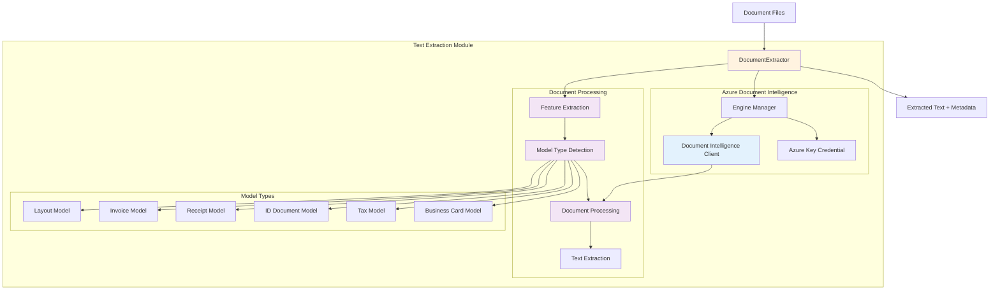

# Douemnt Intelligence Text Extraction Module

The text extraction module provides comprehensive document analysis and text extraction capabilities using Azure Document Intelligence with automatic model selection, multi-format support, and **detailed document structure preservation**.

## Features

✅ **Complete Document Structure** - Pages, tables, figures, paragraphs  
✅ **Spatial Information** - Bounding boxes, coordinates, dimensions  
✅ **Table Analysis** - Cell structure, headers, spans, confidence scores  
✅ **Text Hierarchy** - Lines, words, paragraphs with reading order  
✅ **Selection Marks** - Checkboxes, radio buttons with state detection  
✅ **Handwriting Detection** - Classification and confidence scoring  
✅ **Figure Extraction** - Charts, images with spatial boundaries  
✅ **Multi-Page Support** - Page-by-page analysis with metadata

## Architecture



## Components

### DocumentExtractor
Main interface for document text extraction operations.

**Inputs:**
- Document files (PDF, images)
- Model type specifications
- Processing configuration

**Outputs:**
- Extracted text content
- Document metadata
- Key-value pairs
- Processing statistics
- Model confidence scores

**Key Features:**
- Automatic model type detection
- Multi-format document support
- Intelligent feature extraction
- Comprehensive error handling

### Engine Manager
Manages Azure Document Intelligence client with singleton pattern.

**Responsibilities:**
- Initialize Document Intelligence client
- Manage API credentials
- Provide thread-safe access
- Handle authentication errors

**Supported Models:**
- **Layout**: General document structure and text
- **Invoice**: Commercial invoices and bills
- **Receipt**: Purchase receipts and transaction records
- **ID Document**: Identity cards, passports, licenses
- **Tax Forms**: W-2, 1099, and other tax documents
- **Business Card**: Contact information extraction

## Enhanced Data Structures

### ExtractionResult
Complete document analysis with preserved structure:

```python
@dataclass
class ExtractionResult:
    text_content: str                    # Full extracted text
    pages: List[DocumentPage]            # Page-by-page analysis  
    tables: List[DocumentTable]          # Table structure with cells
    figures: List[Dict[str, Any]]        # Charts, images, diagrams
    paragraphs: List[Dict[str, Any]]     # Semantic text blocks
    key_value_pairs: List[Dict[str, str]] # Structured field data
    metadata: Dict[str, Any]             # Processing metadata
    model_used: str                      # Azure model applied
    confidence_scores: Dict[str, float]  # Model confidence
    processing_time: float               # Performance metrics
```

### DocumentPage  
Detailed page-level information:

```python
@dataclass
class DocumentPage:
    page_number: int                     # 1-indexed page number
    width: float                         # Page width in units
    height: float                        # Page height in units
    unit: str                           # Measurement unit (pixels, inches)
    angle: float                        # Page rotation angle
    lines: List[Dict[str, Any]]         # Text lines with coordinates
    words: List[Dict[str, Any]]         # Individual words with confidence
    selection_marks: List[Dict[str, Any]] # Checkboxes, radio buttons
```

### DocumentTable
Complete table structure with spatial data:

```python
@dataclass  
class DocumentTable:
    row_count: int                       # Number of table rows
    column_count: int                    # Number of table columns
    cells: List[Dict[str, Any]]         # Cell content and positions
    bounding_regions: List[Dict[str, Any]] # Table boundaries
    spans: List[Dict[str, Any]]         # Text span references
```

## Usage Examples

### Enhanced Text Extraction

```python
from da3_obsidian.text_extraction import DocumentExtractor

# Initialize extractor
extractor = DocumentExtractor()

# Extract with full document structure
result = extractor.extract_text("document.pdf")

print(f"Extracted from {result.page_count} pages")
print(f"Found {len(result.tables)} tables")
print(f"Found {len(result.figures)} figures")
print(f"Model used: {result.model_used}")

# Access page-level details
for page in result.pages:
    print(f"Page {page.page_number}: {page.width}×{page.height} {page.unit}")
    print(f"  Lines: {len(page.lines)}")
    print(f"  Words: {len(page.words)}")
    print(f"  Selection marks: {len(page.selection_marks)}")

# Access table structure
for i, table in enumerate(result.tables):
    print(f"Table {i+1}: {table.row_count}×{table.column_count}")
    
    # Examine cells
    for cell in table.cells:
        print(f"  Cell [{cell['row_index']},{cell['column_index']}]: {cell['content']}")
        print(f"    Spans: {cell['row_span']}×{cell['column_span']}")
        print(f"    Type: {cell['kind']}")  # header, content, etc.
```

### Spatial Information Access

```python
# Get text with coordinates
for page in result.pages:
    for line in page.lines:
        content = line['content']
        polygon = line['polygon']  # Bounding polygon coordinates
        print(f"'{content}' at coordinates: {polygon}")
    
    for word in page.words:
        content = word['content']
        confidence = word['confidence']
        polygon = word['polygon']
        print(f"'{content}' (confidence: {confidence:.3f}) at {polygon}")
```

### Table Data Extraction

```python
# Extract structured table data
for table_idx, table in enumerate(result.tables):
    print(f"Table {table_idx + 1}:")
    
    # Create table matrix
    table_data = {}
    for cell in table.cells:
        row = cell['row_index']
        col = cell['column_index']
        content = cell['content']
        is_header = cell['kind'] == 'columnHeader' or cell['kind'] == 'rowHeader'
        
        if row not in table_data:
            table_data[row] = {}
        table_data[row][col] = {
            'content': content,
            'is_header': is_header,
            'row_span': cell['row_span'],
            'column_span': cell['column_span']
        }
    
    # Print table structure
    for row in sorted(table_data.keys()):
        for col in sorted(table_data[row].keys()):
            cell = table_data[row][col]
            marker = "[H]" if cell['is_header'] else "   "
            print(f"{marker} {cell['content']}")
```

### Figure and Image Detection

```python
# Access detected figures
for figure_idx, figure in enumerate(result.figures):
    print(f"Figure {figure_idx + 1}:")
    print(f"  ID: {figure.get('id', 'N/A')}")
    
    # Spatial location
    for region in figure['bounding_regions']:
        page_num = region['page_number']
        polygon = region['polygon']
        print(f"  Located on page {page_num} at: {polygon}")
    
    # Associated text spans
    for span in figure['spans']:
        offset = span['offset']
        length = span['length']
        associated_text = result.text_content[offset:offset+length]
        print(f"  Associated text: '{associated_text}'")
```

### Selection Marks (Forms)

```python
# Process checkboxes and radio buttons
for page in result.pages:
    for mark in page.selection_marks:
        state = mark['state']  # 'selected' or 'unselected'
        confidence = mark['confidence']
        polygon = mark['polygon']
        
        print(f"Selection mark: {state} (confidence: {confidence:.3f})")
        print(f"  Location: {polygon}")
```

### Comprehensive Output Saving

```python
# Save complete structure
def save_detailed_results(result, output_path="detailed_extraction.json"):
    detailed_output = {
        "document_info": {
            "total_pages": result.page_count,
            "total_text_length": len(result.text_content),
            "model_used": result.model_used,
            "processing_time": result.processing_time
        },
        "full_text": result.text_content,
        "pages": [
            {
                "page_number": page.page_number,
                "dimensions": {
                    "width": page.width,
                    "height": page.height,
                    "unit": page.unit,
                    "angle": page.angle
                },
                "content_summary": {
                    "lines": len(page.lines),
                    "words": len(page.words),
                    "selection_marks": len(page.selection_marks)
                },
                "lines": page.lines,
                "words": page.words,
                "selection_marks": page.selection_marks
            }
            for page in result.pages
        ],
        "tables": [
            {
                "index": i,
                "dimensions": {
                    "rows": table.row_count,
                    "columns": table.column_count
                },
                "cells": table.cells,
                "bounding_regions": table.bounding_regions
            }
            for i, table in enumerate(result.tables)
        ],
        "figures": result.figures,
        "paragraphs": result.paragraphs,
        "key_value_pairs": result.key_value_pairs,
        "metadata": result.metadata
    }
    
    with open(output_path, 'w') as f:
        json.dump(detailed_output, f, indent=2)
```

## Configuration

### Environment Variables

Set up your Azure Document Intelligence credentials:

```bash
# Required environment variables
export AZURE_DI_ENDPOINT="https://your-resource.cognitiveservices.azure.com/"
export AZURE_DI_KEY="your-api-key"
```

### Supported File Formats

- **PDF**: `.pdf`
- **Images**: `.jpg`, `.jpeg`, `.png`, `.bmp`, `.tiff`, `.tif`, `.heif`

### Model Selection Logic

The module uses intelligent model detection based on:

1. **Content Analysis**: Text patterns and keywords
2. **Structural Features**: Tables, key-value pairs, layout
3. **Document Properties**: File size, page count
4. **Confidence Scoring**: Weighted term matching

#### Detection Rules

- **Invoice**: Terms like "invoice", "bill to", "due date", tables present
- **Receipt**: Terms like "receipt", "total", "cashier", single page
- **ID Document**: Terms like "license", "passport", "date of birth"
- **Business Card**: Contact info, small file size, single page
- **Tax Forms**: Terms like "W-2", "tax year", "IRS"

## Advanced Features

### Feature Extraction

```python
# Get detailed document analysis
features = extractor.analyze_document("complex_document.pdf")

print(f"Document structure:")
print(f"  Pages: {features.page_count}")
print(f"  Tables: {features.table_count}")
print(f"  Key-value pairs: {len(features.key_value_pairs)}")
print(f"  Processing time: {features.processing_time:.2f}s")

# Access raw features
print(f"File size: {features.file_size:,} bytes")
print(f"Text length: {len(features.text_content):,} characters")
```

### Model Confidence Analysis

```python
result = extractor.extract_text("ambiguous_document.pdf")

print(f"Model used: {result.model_used}")
print(f"Confidence scores: {result.confidence_scores}")

# Check if model detection was confident
if max(result.confidence_scores.values()) < 0.8:
    print("Low confidence detection - consider manual model selection")
```