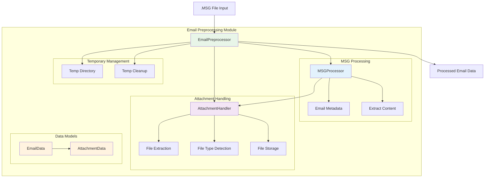

# Email Preprocessing Module

The email preprocessing module provides comprehensive email extraction and preprocessing capabilities from .msg files, including metadata extraction, attachment handling, and temporary file management.

## Architecture



## Components

### EmailPreprocessor
Main interface for email preprocessing operations.

**Inputs:**
- .msg files (path or buffer)
- Configuration settings

**Outputs:**
- EmailData with extracted information
- Extracted attachments in a temporary directory
- Summary statistics

**Key Features:**
- Process .msg files from disk or buffer
- Extract email metadata and content
- Handle attachments automatically
- Manage temporary files
- Generate email summaries

### MSGProcessor
Handles parsing and extraction of .msg file contents.

**Responsibilities:**
- Extract email metadata (subject, sender, etc.)
- Extract email body content
- Process attachments
- Detect embedded emails
- Validate .msg file format

**Key Methods:**
- `extract_from_buffer`: Extract data from file-like objects
- `validate_msg_buffer`: Check validity of .msg data
- `is_msg_file`: Determine if a file is a .msg file

### AttachmentHandler
Manages extraction and processing of email attachments.

**Responsibilities:**
- Extract file attachments to disk
- Generate unique filenames
- Determine content types
- Handle duplicate attachments
- Provide attachment statistics

**Features:**
- Filename sanitization
- Duplicate detection
- Content type inference
- Size and count tracking

### Data Models
Structured representations of email and attachment data.

**EmailData:**
- Basic email metadata (subject, sender, recipients)
- Email body content
- References to attachments
- Temporary directory information

**AttachmentData:**
- Filename and path
- Size information
- Content type
- Support for embedded emails (future)

## Usage Examples

### Basic Email Processing

```python
from da3_obsidian.email_preprocessing import EmailPreprocessor

# Initialize preprocessor
preprocessor = EmailPreprocessor()

# Process a .msg file
email_data = preprocessor.process_msg_file("example.msg")

# Access extracted data
print(f"Subject: {email_data.subject}")
print(f"From: {email_data.sender}")
print(f"Body: {email_data.body[:100]}...")
print(f"Attachments: {len(email_data.attachments)}")

# Cleanup when done
preprocessor.cleanup_email_data(email_data)
```

### Processing from Buffer

```python
with open("example.msg", "rb") as msg_buffer:
    # Process directly from file buffer
    email_data = preprocessor.process_msg_buffer(msg_buffer, "example.msg")

# Access attachments
for attachment in email_data.attachments:
    print(f"Attachment: {attachment.filename}")
    print(f"  Size: {attachment.size} bytes")
    print(f"  Type: {attachment.content_type}")
    print(f"  Path: {attachment.path}")
```

### Getting Email Summary

```python
# Process file
email_data = preprocessor.process_msg_file("business_proposal.msg")

# Get summary statistics
summary = preprocessor.get_email_summary(email_data)
print(f"Email: {summary['filename']}")
print(f"Subject: {summary['subject']}")
print(f"Sender: {summary['sender']}")
print(f"Total Attachments: {summary['total_attachments']}")
print(f"Body Length: {summary['body_length']} characters")
```

### Listing Extracted Files

```python
# Process email with attachments
email_data = preprocessor.process_msg_file("report_with_attachments.msg")

# List all extracted files
files = preprocessor.list_all_files(email_data)
for file_path in files:
    print(f"Extracted: {file_path}")
```

## Configuration Options

### Temporary File Management

```python
# Initialize with temporary file preservation
preprocessor = EmailPreprocessor(preserve_temp_files=True)

# Process file (temp files will be kept)
email_data = preprocessor.process_msg_file("important_data.msg")

# Get temp directory path
temp_dir = email_data.temp_directory
print(f"Files preserved in: {temp_dir}")

# Manually clean up when done
preprocessor.cleanup_email_data(email_data)
```

## Error Handling

```python
from da3_obsidian.email_preprocessing import EmailPreprocessor

preprocessor = EmailPreprocessor()

try:
    # Attempt to process file
    email_data = preprocessor.process_msg_file("suspicious.msg")
    
    # Work with the data
    print(f"Processed: {email_data.subject}")
    
except FileNotFoundError:
    print("The .msg file could not be found")
    
except ValueError as e:
    print(f"Invalid .msg file: {e}")
    
except Exception as e:
    print(f"Processing error: {e}")
    
finally:
    # Clean up resources
    if 'email_data' in locals():
        preprocessor.cleanup_email_data(email_data)
```

## Integration Notes

The email preprocessing module is designed to work seamlessly with other DA3 Obsidian modules:

```python
from da3_obsidian.email_preprocessing import EmailPreprocessor
from da3_obsidian.text_extraction import TextExtractor
from da3_obsidian.text_anonymization import TextAnonymizer

# Step 1: Process email
email_preprocessor = EmailPreprocessor()
email_data = email_preprocessor.process_msg_file("sensitive_email.msg")

# Step 2: Extract text from attachments (if PDFs)
text_extractor = TextExtractor()
attachment_texts = []

for attachment in email_data.attachments:
    if attachment.content_type == "application/pdf":
        text, confidence = text_extractor.extract_from_pdf(attachment.path)
        attachment_texts.append(text)

# Step 3: Anonymize sensitive information
anonymizer = TextAnonymizer()

# Anonymize email body
if email_data.body:
    body_result = anonymizer.anonymize(email_data.body)
    print(f"Anonymized email body: {body_result.anonymized_text}")
    print(f"Found {len(body_result.entities_found)} PII entities in email body")

# Anonymize attachment texts
for text in attachment_texts:
    result = anonymizer.anonymize(text)
    print(f"Found {len(result.entities_found)} PII entities in attachment")

# Clean up
email_preprocessor.cleanup_email_data(email_data)
```