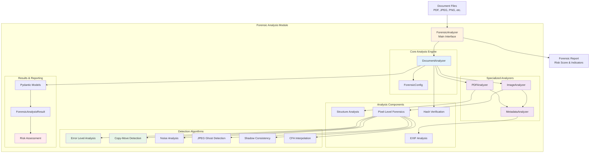

# Forensic Analysis Module

The forensic analysis module provides comprehensive document fraud detection capabilities for PDFs and images. It employs multiple analysis techniques to identify potential manipulation, tampering, and authenticity issues.

## Architecture



## Components

### ForensicAnalyzer
Main interface for document forensic analysis providing high-level operations.

**Inputs:**
- Document files (PDF, JPEG, PNG, BMP, TIFF)
- Optional trusted hash for verification
- Pydantic-based configuration parameters

**Outputs:**
- Structured Pydantic-based analysis results
- Risk assessment and scoring
- Detailed fraud indicators
- Categorized findings

**Key Features:**
- Single document analysis
- Batch processing capabilities
- Configurable thresholds
- Format-specific optimizations

### Core Analysis Components

#### DocumentAnalyzer
Central coordinator that manages the analysis workflow and orchestrates specialized analyzers.

**Responsibilities:**
- File validation and type detection
- Analysis workflow coordination
- Result aggregation and risk scoring
- Error handling and reporting

#### PDFAnalyzer
Specialized analyzer for PDF documents with comprehensive structural analysis.

**Analysis Areas:**
- **Metadata Validation**: Creation dates, producer info, modification history
- **Structure Integrity**: Version consistency, incremental updates, object analysis
- **Security Features**: Digital signatures, encryption, JavaScript content
- **Content Analysis**: Embedded files, layers, forms, annotations
- **Page Rendering**: Convert pages to images for pixel-level analysis

#### ImageAnalyzer
Advanced image forensics using multiple detection algorithms.

**Analysis Techniques:**
- **Error Level Analysis (ELA)**: Detect compression inconsistencies
- **Copy-Move Detection**: Identify duplicated regions using feature matching
- **Noise Analysis**: Examine noise patterns for tampering evidence
- **JPEG Forensics**: Quantization table analysis and ghost detection
- **Shadow Consistency**: Lighting direction analysis
- **Edge Integrity**: Splicing artifact detection
- **CFA Interpolation**: Color filter array pattern analysis

#### MetadataAnalyzer
Examines document metadata for inconsistencies and fraud indicators.

**Validation Areas:**
- **Temporal Consistency**: Date/time field validation
- **Software Detection**: Identify editing applications
- **Camera Information**: Make/model consistency checks
- **GPS Validation**: Location data integrity
- **Field Completeness**: Missing essential metadata

## Detection Algorithms

### Image Manipulation Detection

#### Error Level Analysis (ELA)
Detects areas with different compression levels indicating manipulation.

**Process:**
1. Save image at known quality level (default 95%)
2. Compare with original using pixel difference
3. Analyze error distribution and amplify differences
4. Identify regions with unusual error patterns

**Indicators:**
- High mean difference values
- Unusual standard deviation patterns
- Localized high-error regions

#### Copy-Move Forgery Detection
Identifies duplicated regions within the same image.

**Process:**
1. Extract keypoints using SIFT/ORB feature detection
2. Match descriptors to find similar regions
3. Filter matches by distance and spatial separation
4. Count significant non-adjacent matches

**Indicators:**
- Multiple similar regions with spatial separation
- Consistent feature patterns in different areas
- High number of good matches above threshold

#### Noise Pattern Analysis
Examines noise consistency across image regions.

**Process:**
1. Extract noise using high-pass filtering
2. Divide image into analysis grid (4x4 regions)
3. Calculate noise statistics per region
4. Analyze variance across regions

**Indicators:**
- Inconsistent noise mean values
- Varying noise standard deviations
- Regions with unusual noise characteristics

### PDF Structure Analysis

#### Incremental Update Detection
Identifies PDF editing through version analysis.

**Process:**
1. Count EOF markers in PDF file
2. Analyze object revision numbers
3. Check for timestamp inconsistencies
4. Validate update chains

**Indicators:**
- Multiple EOF markers
- Out-of-sequence object updates
- Missing intermediate versions

#### JavaScript Content Detection
Scans for embedded JavaScript that may indicate malicious intent.

**Process:**
1. Search PDF objects for JS/JavaScript keywords
2. Analyze action dictionaries
3. Check form field scripts
4. Validate execution contexts

**Indicators:**
- Presence of JavaScript code
- Hidden script execution
- Suspicious action triggers

## Risk Assessment

### Scoring Algorithm
Calculates risk score based on weighted fraud indicators.

**Factors:**
- Number of fraud indicators found
- Severity of individual issues
- Category distribution of problems
- File type specific considerations

**Risk Levels:**
- **Low (0-19)**: Minimal concerns, likely authentic
- **Medium (20-49)**: Some indicators present, requires review  
- **High (50-79)**: Multiple serious indicators, likely manipulated
- **Very High (80-100)**: Extensive evidence of tampering

### Indicator Categories
Fraud indicators are categorized for targeted analysis:

- **Metadata Issues**: Date inconsistencies, missing fields, suspicious software
- **Image Manipulation**: ELA anomalies, copy-move evidence, noise irregularities
- **Structure Anomalies**: Version mismatches, JavaScript, hidden content
- **Text Inconsistencies**: Font variations, formatting irregularities

## Usage Examples

### Quick Analysis (Original Interface Style)

```python
from da3_obsidian.forensic_analysis import analyze_document

# Quick analysis using convenience function (matches original forensics_checks.py)
result = analyze_document('suspicious_contract.pdf')

print(f"Risk Level: {result.risk_level}")
print(f"Risk Score: {result.risk_score}/100")
print(f"Fraud Indicators: {len(result.fraud_indicators)}")

# Check specific issue types
if result.has_metadata_issues:
    print("⚠️ Metadata inconsistencies detected")
    
if result.has_image_manipulation:
    print("⚠️ Potential image manipulation found")
    
if result.has_structure_anomalies:
    print("⚠️ PDF structure anomalies detected")
```

### Full Analyzer Interface

```python
from da3_obsidian.forensic_analysis import ForensicAnalyzer

# Initialize analyzer
analyzer = ForensicAnalyzer()

# Analyze single document
result = analyzer.analyze_document('suspicious_contract.pdf')

print(f"Risk Level: {result.risk_level}")
print(f"Risk Score: {result.risk_score}/100")
print(f"Fraud Indicators: {len(result.fraud_indicators)}")

# Access detailed fraud indicators
for indicator in result.fraud_indicators[:5]:  # Show first 5
    print(f"  - {indicator}")
```

### Advanced Configuration with Pydantic

```python
from da3_obsidian.forensic_analysis import ForensicAnalyzer, ForensicConfig

# Create custom configuration using dictionary
config_dict = {
    'Analysis': {
        'max_pdf_pages': 50,        # Analyze more pages
        'jpeg_quality': 90          # Different ELA compression level
    },
    'Thresholds': {
        'ela_mean_threshold': 3.0,  # More sensitive ELA detection
        'copy_move_threshold': 15   # Less sensitive copy-move detection
    }
}

config = ForensicConfig.from_dict(config_dict)

# Initialize with custom config
analyzer = ForensicAnalyzer(config)

# Analyze with trusted hash verification
result = analyzer.analyze_document(
    'important_document.pdf',
    trusted_hash='sha256_hash_here'
)

# Get detailed analysis summary
summary = analyzer.get_analysis_summary(result)
print(f"Analysis Summary: {summary}")
```

### Batch Processing

```python
# Analyze multiple documents
file_paths = [
    'document1.pdf',
    'image1.jpg', 
    'document2.pdf'
]

results = analyzer.batch_analyze(file_paths)

# Process results (all results are guaranteed to be valid - fail-fast behavior)
for file_path, result in results.items():
    print(f"{file_path}: {result.risk_level} ({result.risk_score}/100)")
    
    # Get issues by category
    issues = result.get_issues_by_category()
    for category, indicators in issues.items():
        if indicators:
            print(f"  {category}: {len(indicators)} issues")

# Get risk distribution
risk_distribution = analyzer.get_risk_distribution(results)
print(f"Risk Distribution: {risk_distribution}")
```

### Format-Specific Analysis

```python
# PDF-specific analysis
pdf_result = analyzer.analyze_pdf('contract.pdf')
print(f"File: {pdf_result.file_path}")
print(f"Risk: {pdf_result.risk_level}")

# Access raw PDF analysis data
pdf_structure = pdf_result.raw_results.get('integrity_analysis', {}).get('pdf_structure', {})
if pdf_structure:
    print(f"Incremental updates: {pdf_structure.get('incremental_updates', 0)}")
    print(f"Has JavaScript: {pdf_structure.get('has_javascript', False)}")

# Image-specific analysis  
image_result = analyzer.analyze_image('photo.jpg')
print(f"File: {image_result.file_path}")
print(f"Risk: {image_result.risk_level}")

# Access raw image analysis data
image_data = image_result.raw_results.get('image_analysis', {})
ela_result = image_data.get('error_level_analysis', {})
copy_move_result = image_data.get('copy_move_detection', {})

print(f"ELA suspicious: {ela_result.get('suspicious', False)}")
print(f"Copy-move detected: {copy_move_result.get('suspicious', False)}")
```

### Runtime Threshold Configuration

```python
# Update thresholds at runtime
analyzer.configure_thresholds(
    ela_mean_threshold=2.5,
    noise_mean_threshold=1.5,
    copy_move_threshold=20
)

# Analyze with new thresholds
result = analyzer.analyze_document('test_image.jpg')
```

### File Integrity Verification

```python
# Verify file integrity with known hash
file_path = 'trusted_document.pdf'
expected_hash = 'known_sha256_hash_value'

is_valid = analyzer.verify_file_integrity(file_path, expected_hash)
print(f"File integrity check: {'✓ PASSED' if is_valid else '✗ FAILED'}")
```

### Export Results

```python
# Export analysis results
result = analyzer.analyze_document('document.pdf')

# Export as JSON
analyzer.export_results(result, 'analysis_report.json', format='json')

# Export as text report
analyzer.export_results(result, 'analysis_report.txt', format='txt')
```

## Configuration Options

### Analysis Limits
- **max_pdf_pages**: Maximum PDF pages to analyze (default: 20)
- **max_images**: Maximum embedded images to process (default: 50)
- **jpeg_quality**: JPEG quality for ELA analysis (default: 95)

### Detection Thresholds
- **ela_mean_threshold**: ELA mean difference threshold (default: 5.0)
- **ela_std_threshold**: ELA standard deviation threshold (default: 10.0)
- **copy_move_threshold**: Copy-move detection sensitivity (default: 10)
- **noise_mean_threshold**: Noise analysis mean threshold (default: 2.0)
- **ghost_ratio_threshold**: JPEG ghost detection ratio (default: 0.05)

### Structure Analysis
- **font_count_threshold**: Maximum fonts before flagging (default: 3)
- **straight_lines_threshold**: Edge analysis line detection (default: 5)
- **shadow_direction_threshold**: Shadow consistency angle (default: 45°)

## Pydantic Data Models

The module uses Pydantic for all structured data modeling, providing:

- **Type validation**: Automatic validation of data types
- **Serialization**: Easy conversion to/from JSON
- **Documentation**: Self-documenting data structures
- **IDE support**: Full type hints and autocomplete

### Key Models

```python
from da3_obsidian.forensic_analysis.models import (
    ForensicAnalysisResult,
    ImageAnalysisResult,
    PDFStructureResult,
    TextAnalysisResult,
    RiskLevel
)

# All models provide validation and serialization
result = analyzer.analyze_document('file.pdf')
print(result.model_dump())  # Serialize to dict
print(result.model_dump_json())  # Serialize to JSON
```