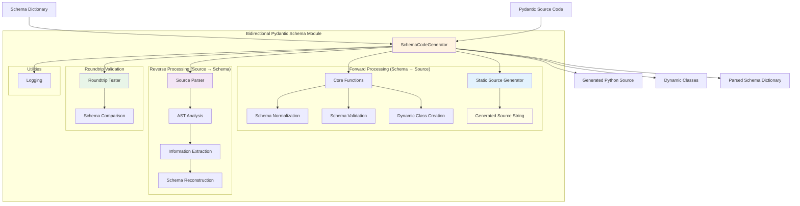

# Pydantic Schema Code Generation Module

The pydantic schema code generation module provides **bidirectional conversion** between schema dictionaries and Pydantic model source code, with dynamic class creation and static source code generation capabilities.

## New Features

🆕 **Source Code Parsing**: Parse existing Pydantic source code back into schema dictionaries  
🔄 **Roundtrip Conversion**: Full schema ↔ source code bidirectional support  
✅ **Roundtrip Validation**: Ensure consistency between conversions  

## Architecture



## Components

### SchemaCodeGenerator
Enhanced main interface supporting bidirectional operations.

**Forward Operations (Schema → Source):**
- Schema dictionaries → Python source code
- Dynamic class creation
- Source code generation as strings

**Reverse Operations (Source → Schema):**
- Pydantic source code → Schema dictionaries  
- AST-based parsing
- Field information extraction

**Validation:**
- Roundtrip testing (Schema → Source → Schema)
- Schema structure validation
- Consistency verification

### Source Parser
New AST-based parser for extracting schema information from Pydantic source code.

**Features:**
- Parse class definitions and inheritance
- Extract field type annotations
- Parse Field() parameters and constraints
- Handle aliases and sanitized identifiers
- Support complex type annotations

**Files:**
- `source_parser.py` - AST parsing and schema extraction
- Enhanced `generator.py` - Bidirectional interface
- `core.py` - Schema processing and validation
- `source_generator.py` - Static source code generation

## Usage Examples

### Bidirectional Conversion

```python
from da3_obsidian.pydantic_schema_codegen import SchemaCodeGenerator

generator = SchemaCodeGenerator()

# Forward: Schema → Source
schema = {
    "User": {
        "fields": {
            "name": {"type": "str", "required": True, "description": "User name"},
            "email": {"type": "str", "required": True},
            "age": {"type": "int", "required": False, "default": 0, "constraints": {"ge": 0}}
        },
        "class_description": "User model"
    }
}

# Generate source code
result = generator.generate_from_dict(schema)
source_code = result.generated_source

print("Generated source:")
print(source_code)

# Reverse: Source → Schema  
parsed_result = generator.parse_from_source(source_code)
parsed_schema = parsed_result.parsed_schema

print(f"Parsed {parsed_result.classes_found} classes back from source")
```

### Parse Existing Pydantic Code

```python
# Parse hand-written Pydantic models
existing_code = '''
from pydantic import BaseModel, Field
from typing import Optional

class Product(BaseModel):
    """Product information model"""
    name: str = Field(..., description="Product name", min_length=1)
    price: float = Field(..., gt=0, description="Price in USD")  
    category: Optional[str] = Field("general", description="Product category")
    in_stock: bool = Field(True, description="Whether product is available")
'''

# Parse into schema dictionary
schema = generator.parse_source_code(existing_code)

print("Parsed schema:")
for class_name, class_info in schema['classes'].items():
    print(f"Class: {class_name}")
    print(f"Description: {class_info.get('class_description', 'None')}")
    print(f"Fields: {len(class_info['fields'])}")
```

### Roundtrip Validation

```python
# Test that schema → source → schema works correctly
original_schema = {
    "TestModel": {
        "fields": {
            "name": {"type": "str", "required": True},
            "value": {"type": "int", "required": False, "default": 42}
        }
    }
}

# Test roundtrip conversion
success = generator.test_roundtrip(original_schema)

if success:
    print("✓ Roundtrip validation passed!")
else:
    print("✗ Roundtrip validation failed")
```

### Parse and Regenerate

```python
# Full workflow: parse existing code, modify, and regenerate
existing_source = '''
class User(BaseModel):
    name: str = Field(...)
    email: str = Field(...)
'''

# Parse existing code
parsed = generator.parse_from_source(existing_source)

# Modify the schema
user_schema = parsed.parsed_schema['classes']['User']
user_schema['fields']['age'] = {
    "type": "int", 
    "required": False, 
    "default": 0,
    "constraints": {"ge": 0, "le": 120}
}

# Regenerate with modifications
new_result = generator.generate_from_dict(parsed.parsed_schema)
print("Enhanced model:")
print(new_result.generated_source)
```

## New API Methods

### Parsing Methods

```python
# Parse source code to schema
parse_result = generator.parse_from_source(source_code)
# Returns: ParseResult with parsed_schema, classes_found, etc.

# Direct parsing function
from da3_obsidian.pydantic_schema_codegen import parse_pydantic_source
schema = parse_pydantic_source(source_code)

# Low-level parser class
from da3_obsidian.pydantic_schema_codegen import PydanticSourceParser
parser = PydanticSourceParser()
schema = parser.parse_source(source_code)
```

### Validation Methods

```python
# Test roundtrip conversion
success = generator.test_roundtrip(original_schema)

# Basic structure validation  
is_valid = generator.validate_schema_structure(schema)
```

## Supported Parsing Features

### Class Features
- ✅ BaseModel inheritance
- ✅ Class docstrings → class_description
- ✅ Multiple base classes
- ✅ Complex inheritance patterns

### Field Features
- ✅ Type annotations (str, int, float, bool, etc.)
- ✅ Complex types (Optional, List, Dict, Union, etc.)
- ✅ Field() parameters and constraints
- ✅ Default values and required fields
- ✅ Field descriptions
- ✅ Field aliases (for sanitized names)
- ✅ All Pydantic constraints (min_length, max_length, gt, ge, lt, le, etc.)

### Advanced Features
- ✅ Sanitized identifier handling
- ✅ Reserved keyword conflicts
- ✅ Default factory functions
- ✅ Complex default values
- ✅ Nested constraint dictionaries

## Schema Structure

The parsed schema maintains the same format as the original generation schema:

```json
{
  "classes": {
    "ClassName": {
      "fields": {
        "field_name": {
          "type": "str",
          "required": true,
          "description": "Field description",
          "default": "default_value",
          "constraints": {
            "min_length": 1,
            "max_length": 100
          }
        }
      },
      "base_classes": ["BaseModel"],
      "class_description": "Class description"
    }
  }
}
```

The module now provides complete bidirectional conversion between schema dictionaries and Pydantic source code, enabling powerful code generation, migration, and analysis workflows.