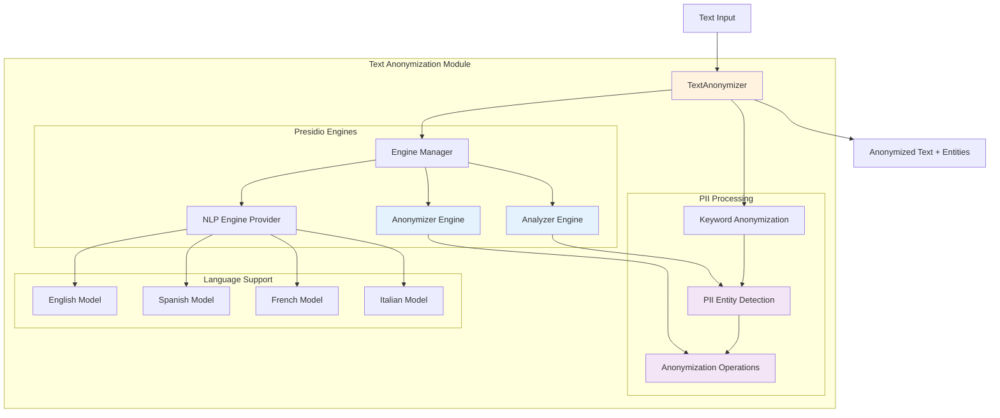

# Text Anonymization Module

The text anonymization module provides comprehensive PII (Personally Identifiable Information) detection and anonymization capabilities using Microsoft Presidio with multi-language support.

## Architecture



## Components

### TextAnonymizer
Main interface for text anonymization operations.

**Inputs:**
- Raw text content
- Entity type specifications
- Language configuration
- Anonymization settings

**Outputs:**
- Anonymized text
- Detected PII entities
- Processing metadata
- Confidence scores

**Key Features:**
- Multi-language PII detection
- Customizable anonymization operators
- Keyword-based preprocessing
- Comprehensive entity support

### Engine Manager
Manages Presidio engines with singleton pattern and multi-language support.

**Responsibilities:**
- Initialize Presidio engines
- Manage spaCy language models
- Provide thread-safe access
- Handle configuration validation

**Supported Models:**
- English: `en_core_web_lg`
- Spanish: `es_core_news_lg` 
- French: `fr_core_news_lg`
- Italian: `it_core_news_lg`


## Usage Examples

### Basic Anonymization

```python
from da3_obsidian.text_anonymization import TextAnonymizer

# Initialize anonymizer
anonymizer = TextAnonymizer(language='en')

# Simple anonymization
text = "Hi, I'm John Doe. My email is john.doe@company.com and phone is 555-123-4567."
result = anonymizer.anonymize(text)

print(f"Original: {text}")
print(f"Anonymized: {result.anonymized_text}")
print(f"Entities found: {len(result.entities_found)}")

# Output:
# Original: Hi, I'm John Doe. My email is john.doe@company.com and phone is 555-123-4567.
# Anonymized: Hi, I'm <PERSON>. My email is <EMAIL_ADDRESS> and phone is <PHONE_NUMBER>.
# Entities found: 3
```

### Entity-Specific Anonymization

```python
# Target specific entity types only
result = anonymizer.anonymize(
    text=text,
    entities=["PERSON", "EMAIL_ADDRESS"]  # Only anonymize names and emails
)

# Analyze without anonymizing
entities = anonymizer.analyze(text)
for entity in entities:
    print(f"Found {entity.entity_type}: '{entity.text}' (confidence: {entity.confidence:.2f})")
```

### Custom Anonymization Operators

```python
# Create custom anonymization configuration
custom_config = anonymizer.create_custom_operators_config({
    "PERSON": {
        "type": "replace", 
        "new_value": "[REDACTED_NAME]"
    },
    "EMAIL_ADDRESS": {
        "type": "mask",
        "masking_char": "*",
        "chars_to_mask": 5,
        "from_end": True
    },
    "PHONE_NUMBER": {
        "type": "replace",
        "new_value": "XXX-XXX-XXXX"
    }
})

result = anonymizer.anonymize(
    text=text,
    anonymization_config=custom_config
)
```

### Multi-Language Processing

```python
# Spanish text processing
spanish_anonymizer = TextAnonymizer(language='es')

spanish_text = "Hola, soy María García. Mi correo es maria.garcia@empresa.com"
result = spanish_anonymizer.anonymize(spanish_text)

# French text processing  
french_anonymizer = TextAnonymizer(language='fr')

french_text = "Bonjour, je suis Jean Dupont. Mon email est jean.dupont@societe.fr"
result = french_anonymizer.anonymize(french_text)
```

### Keyword-Based Preprocessing

```python
# Enable keyword-based anonymization
result = anonymizer.anonymize(
    text="Name: John Smith, Phone: 555-0123, Email: john@example.com",
    keyword_anonymization=True
)

# This will first apply keyword patterns, then Presidio analysis
```

### Advanced Analysis

```python
# Get detailed analysis
entities = anonymizer.analyze(text)

# Get anonymization summary
result = anonymizer.anonymize(text)
summary = anonymizer.get_anonymization_summary(result)

print(f"Total entities: {summary['total_entities_found']}")
print(f"By type: {summary['entities_by_type']}")
print(f"Average confidence: {summary['average_confidence']:.2f}")
```

## Configuration Options

### Language Settings

```python
# Change language
anonymizer.set_language('es')  # Switch to Spanish

# Get supported languages
languages = anonymizer.get_supported_languages()
print(f"Supported: {languages}")  # ['en', 'es', 'fr', 'it']
```

### Entity Configuration

```python
# Get all supported entities
entities = anonymizer.get_supported_entities()

# Validate entities before use
try:
    result = anonymizer.anonymize(text, entities=["CUSTOM_ENTITY"])
except ValueError as e:
    print(f"Invalid entity: {e}")
```

## Multi-Language Support

### Language Models
Each language requires corresponding spaCy model:

```bash
# Install required models
python -m spacy download en_core_web_lg    # English
python -m spacy download es_core_news_lg   # Spanish  
python -m spacy download fr_core_news_lg   # French
python -m spacy download it_core_news_lg   # Italian
```

### Language-Specific Features

- **Spanish**: Character normalization (á, é, í, ó, ú, ñ)
- **French**: Accent handling and formal address detection
- **Italian**: Regional name variations and formal titles
- **English**: Comprehensive entity coverage and slang detection

## Error Handling

```python
try:
    result = anonymizer.anonymize(text)
except ValueError as e:
    print(f"Configuration error: {e}")
except RuntimeError as e:
    print(f"Engine error: {e}")
except Exception as e:
    print(f"Unexpected error: {e}")
```

## Dependencies

- **presidio-analyzer**: Core PII detection engine
- **presidio-anonymizer**: Text anonymization operations
- **spacy**: Natural language processing models
- **regex**: Advanced pattern matching for keywords

## Integration Notes

The anonymization module is designed to work seamlessly with the text extraction module:

```python
from da3_obsidian.text_extraction import TextExtractor
from da3_obsidian.text_anonymization import TextAnonymizer

# Extract text from document
extractor = TextExtractor(language='en')
text, confidence = extractor.extract_from_pdf('document.pdf')

# Anonymize extracted text
anonymizer = TextAnonymizer(language='en')
result = anonymizer.anonymize(text)

print(f"Extracted and anonymized {len(result.entities_found)} PII entities")
```