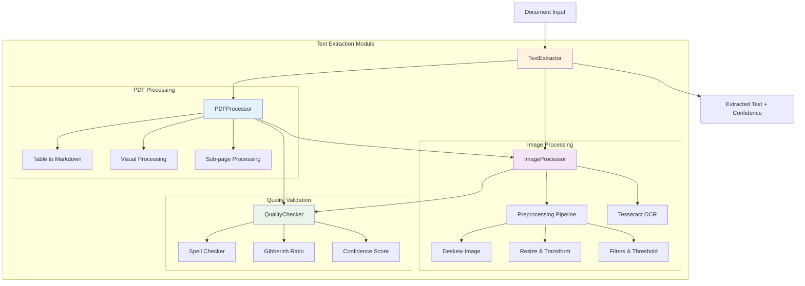

# Text Extraction Module

The text extraction module provides comprehensive capabilities for extracting text from various document formats including PDFs and images using advanced OCR technology.

## Architecture



## Components

### TextExtractor
Main interface for text extraction operations.

**Inputs:**
- PDF files
- Image files (PNG, JPEG, TIFF, etc.)
- Language configuration
- Quality thresholds

**Outputs:**
- Extracted text
- Confidence scores
- Quality metrics

**Key Features:**
- Multi-format support
- Language-specific processing
- Quality validation
- Configurable thresholds

### PDFProcessor
Handles PDF-specific text extraction with table and image processing.

**Inputs:**
- PDF file path
- Language settings
- OCR configuration

**Outputs:**
- Structured text with page breaks
- Markdown-formatted tables
- Combined digital + OCR text
- Confidence assessment

**Processing Pipeline:**
1. Digital text extraction using pdfplumber
2. Table detection and markdown conversion
3. Image extraction and OCR processing
4. Duplicate image detection
5. Quality validation and scoring

### ImageProcessor
Advanced image preprocessing and OCR using Tesseract.

**Inputs:**
- Image arrays or file paths
- Language configuration
- Preprocessing parameters

**Outputs:**
- Extracted text
- Preprocessed images
- Processing metadata

**Preprocessing Pipeline:**
1. **Dynamic Resizing**: Scale large images for optimal processing
2. **Deskewing**: Correct text rotation using skew detection
3. **Noise Reduction**: Apply median blur and bilateral filtering
4. **Contrast Enhancement**: CLAHE for better text visibility
5. **Binarization**: Adaptive and Otsu thresholding
6. **Morphological Operations**: Clean up text boundaries
7. **Contour Filtering**: Remove small artifacts

### QualityChecker
Validates OCR output quality using linguistic analysis.

**Inputs:**
- Raw OCR text
- Language configuration
- Quality thresholds

**Outputs:**
- Gibberish ratios
- Confidence levels
- Validation results

**Quality Metrics:**
- **Spell Checking**: Multi-language dictionary validation
- **Gibberish Detection**: Statistical analysis of word validity
- **Confidence Scoring**: Digital vs OCR text ratio analysis
- **Character Normalization**: Handle special characters (Spanish, etc.)

## Usage Examples

### Basic Text Extraction

```python
from da3_obsidian.text_extraction import TextExtractor

# Initialize with English
extractor = TextExtractor(language='en', gibberish_threshold=0.7)

# Extract from PDF
text, confidence = extractor.extract_from_pdf('document.pdf')
print(f"Confidence: {confidence}")
print(f"Text: {text[:200]}...")

# Extract from image
image_text = extractor.extract_from_image('scan.png')
print(f"OCR Result: {image_text}")
```

### Advanced Configuration

```python
# Multi-language processing
extractor = TextExtractor(language='es', gibberish_threshold=0.5)

# Change settings
extractor.set_language('fr')
extractor.set_gibberish_threshold(0.8)

# Quality assessment
quality_ratio = extractor.get_text_quality_score(text)
is_good = extractor.is_text_high_quality(text)
```

### Component-Level Usage

```python
from da3_obsidian.text_extraction import PDFProcessor, ImageProcessor

# Direct PDF processing
pdf_proc = PDFProcessor(language='en')
text, conf = pdf_proc.extract_from_pdf('doc.pdf')

# Direct image processing
img_proc = ImageProcessor(language='en')
text = img_proc.extract_from_file('image.jpg')
```